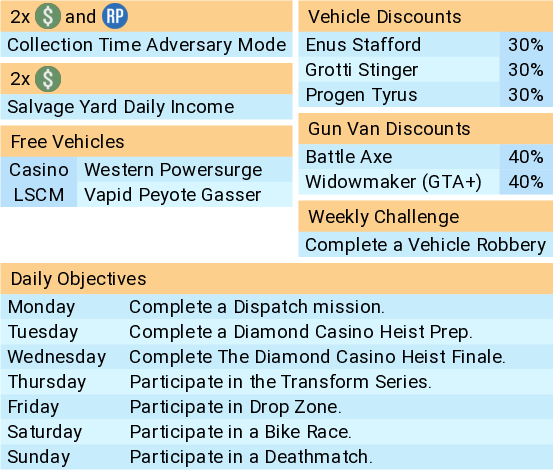

# rawberth New Dawn GTA Updates

## Build virtual environment
```shell
python -m venv venv
source venv/bin/activate
pip install weasyprint wand
```

## Run the prototype script
Update [image.py](image.py) to your liking and start.
```
python -m gtaupdates.image
```
You should now have an [image.png](image.png) file!

> 
